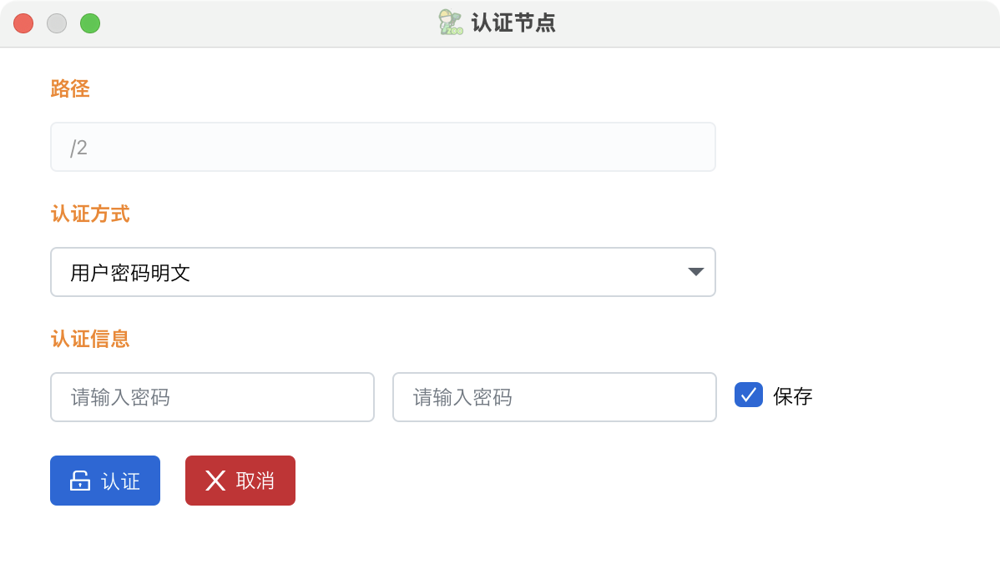
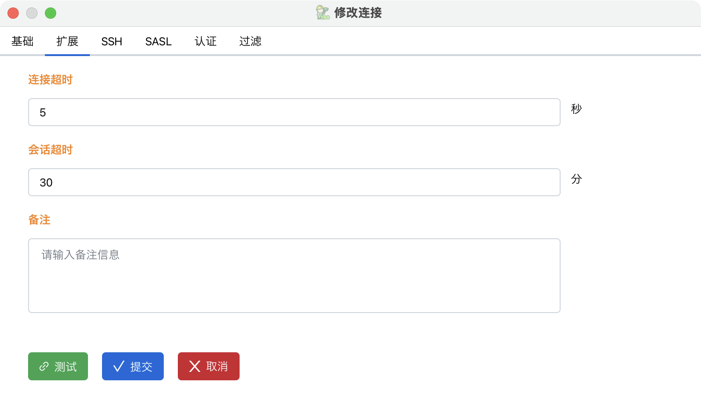

# 项目
###### 项目说明
这是一个使用javafx编写的zookeeper客户端，支持基本的连接管理，分组管理、键操作、操作命令查看、节点认证，权限管理、配额管理、节点二维码、节点搜索、节点过滤、节点历史、导入导出、数据传输、服务监控、认证管理、sasl认证、终端操作、ssh跳板等功能，还支持暗色主题、系统主题跟随等能力

###### 启动入口
cn.oyzh.easyzk.EasyZKBootstrap.main

###### 下载地址
https://gitee.com/oyzh1994/easyzk/releases

###### 依赖说明
1. base工程  
 https://gitee.com/oyzh1994/base
2. fx-base工程  
 https://gitee.com/oyzh1994/fx-base
3. jdk版本要求23

###### 结构说明 
docker -> docker配置文件  
package -> 打包相关配置  
resource -> 项目相关资源文件  
scripts -> 项目相关脚本文件(已废弃)  
src -> 项目相关代码

# Maven
###### 打包
mvn -X clean package -DskipTests

###### 注意
检查cmd里面java -version的版本号和项目版本号是否一致，否则可能出现无效的目标版本号21之类的问题

# 程序打包
###### 图标转换
###### png转icns
https://anyconv.com/png-to-icns-converter/
###### png转ico
https://www.freeconvert.com/zh/png-to-ico

###### windows x64
###### exe、msi打包依赖
https://github.com/wixtoolset/wix3/releases  
###### (推荐)exe打包 
配置 -> package -> win -> win_amd64_pack_config.json  
入口 -> cn.oyzh.easyzk.test.ZKPack.easyzk_win_amd64_exe  
###### msi打包 
配置 -> package -> win -> win_amd64_msi.json  
入口 -> cn.oyzh.easyzk.test.ZKPack.easyzk_win_amd64_msi  
###### app-image打包
配置 -> package -> win -> win_amd64_image.json  
入口 -> cn.oyzh.easyzk.test.ZKPack.easyzk_win_amd64_image  
###### 注意事项
exe、msi打包需要设置win-menu、win-shortcut参数，避免桌面不显示程序图标的问题

###### macos arm64
###### (推荐)pkg打包
配置 -> package -> macos -> macos_arm64_pkg.json  
入口 -> cn.oyzh.easyzk.test.ZKPack.easyzk_macos_arm64_pkg
###### dmg打包 
配置 -> package -> macos -> macos_arm64_dmg.json  
入口 -> cn.oyzh.easyzk.test.ZKPack.easyzk_macos_arm64_dmg  
###### app-image打包
配置 -> package -> macos -> macos_arm64_image.json  
入口 -> cn.oyzh.easyzk.test.ZKPack.easyzk_macos_arm64_image  
###### 注意事项
dmg、pkg打包需要设置mac-package-identifier参数，避免因为app同名，启动台不显示程序图标的问题

# Docker
###### docker启动zk(单个)
docker run -itd -p 2181:2181 zookeeper
###### docker启动zk(集群)
docker-compose -f .\zk-cluster-compose.yml up -d

# Macos系统
###### mac执行dmg安装后，启动台不显示程序图标解决方案
defaults write com.apple.dock ResetLaunchPad -bool true && killall Dock
###### mac无法启动解决方案1
sudo chmod +x EasyZK.app
###### mac无法启动解决方案2
chmod -R 755 /路径/EasyZK.app(可拖入命令行窗口)
###### mac无法启动解决方案3
当在macOS上运行.app文件时提示“已损坏，无法打开”，你可以尝试以下几种解决方法：
1. 允许“任何来源”下载的App运行‌
   打开“系统偏好设置”->“安全性与隐私”->“通用”选项卡。
   检查是否已经启用了“任何来源”选项。如果没有启用，先点击左下角的小黄锁图标解锁，然后选中“任何来源”‌1。
   如果“任何来源”选项不可用，可以打开终端，输入命令sudo spctl --master-disable，然后按提示输入电脑的登录密码并回车，即可启用“任何来源”选项‌12。

# 程序相关截图
###### 截图1

###### 截图2

###### 截图3

###### 截图4

###### 截图5

###### 截图6

###### 截图7

###### 截图8

###### 截图9

###### 截图8

###### 截图11

###### 截图12

###### 截图13

###### 截图14

###### 截图15

###### 截图16

###### 截图17

###### 截图18

###### 截图19

###### 截图20

###### 截图21

###### 截图22

###### 截图23

###### 截图24

###### 截图25

###### 截图26

###### 截图27

###### 截图28

###### 截图29

###### 截图30

###### 截图31

###### 截图32
